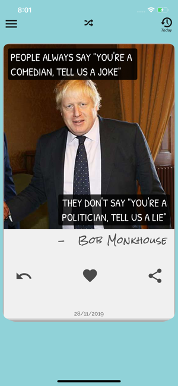
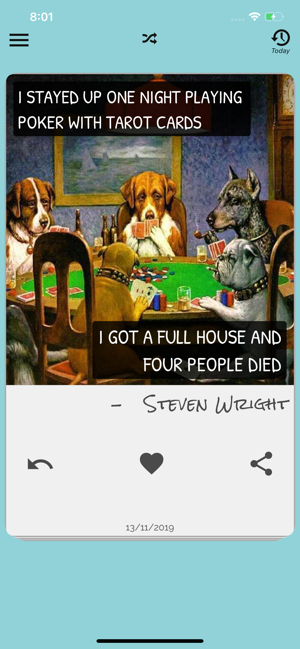
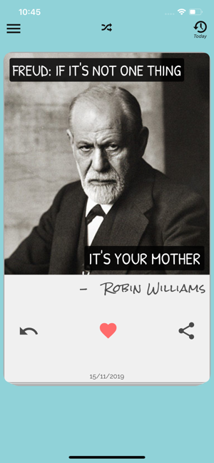
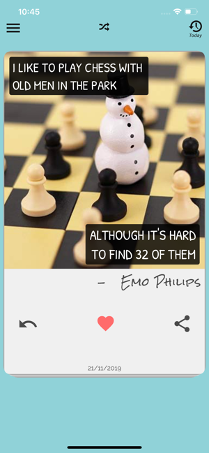
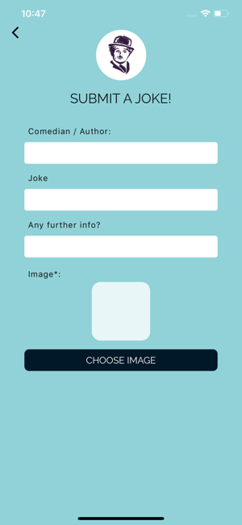
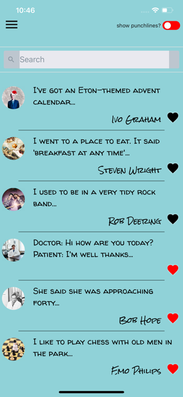
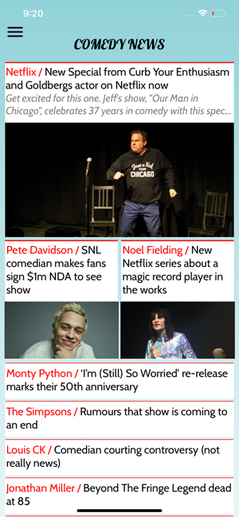

<h1 align="center"><b> Jokes App</b> React-Native</h1>

<h1 align="center">
   
  <kbd>
    
  </kbd>
   
    
</h1>

Our brand spanking new app brings you great jokes to your phone every day from the world's greatest ever comedians.

<i>"How to save a life?" - The Jokes</i> 

  
  
  
  

  <a href="#blush-overview">Overview</a> •
  <a href="#dizzy-roadmap">Roadmap</a> •
  <a href="#wrench-install-instructions">Install</a> •
  <a href="#zap-tech-stack">Tech Stack</a> •
  <a href="#iphone-Test">Test</a> •
  <a href="#eyes-version">Version</a> •

  <kbd>
    
  </kbd>
  &nbsp;&nbsp;&nbsp;&nbsp;
  <kbd>
    
  </kbd>
  &nbsp;&nbsp;&nbsp;&nbsp;
  <kbd>
    
  </kbd>
    
  <kbd>
    
  </kbd>
    &nbsp;&nbsp;&nbsp;&nbsp;
  <kbd>
    
  </kbd>
    &nbsp;&nbsp;&nbsp;&nbsp;
  <kbd>
    
  </kbd>
    
  <kbd>
    
  </kbd>
    &nbsp;&nbsp;&nbsp;&nbsp;
  <kbd>
    
  </kbd>
    &nbsp;&nbsp;&nbsp;&nbsp;
  <kbd>
    
  </kbd>

## :blush: **Overview?**

Our brand spanking new app brings you great jokes to your phone every day from the world's greatest ever comedians.

We also bring you the latest news and recommendations from the comedy and stand-up comedy worlds.

Plus you can login and like/save your favourites and press to share the jokes with your mates.

Our search screen lets you search through all of the jokes, and the new one is bought to you every day by a notification.

There is no better joke app out there- it really is joyous stuff. Tuck in.

## :dizzy: **Roadmap**

-   [x] Make it work on IOS
-   [x] Make it work on Android
-   [x] Transform into responsive
-   [x] Update to latest React Native version
-   [x] AWS-AMPLIFY
-   [x] Appsynce, Cognito, DynamoDB, Apollo, Graphql

## :wrench: **Install instructions**

### Getting Started

#### 1) Clone & Install Dependencies

- 1.1) `git clone https://github.com/funnyjerry/react-native-joke-daily.git`
- 1.2) `cd react-native-jokes-app` - cd into your newly created project directory.
- 1.3) Install NPM packages with `yarn install`
        **Note:** NPM has issues with React Native so `yarn` is recommended over `npm`.
- 1.4) **[iOS]** `cd ios` and run `pod install` - if you don't have CocoaPods you can follow [these instructions](https://guides.cocoapods.org/using/getting-started.html#getting-started) to install it.
- 1.5) **[Android]** If you haven't already generated a `debug.keystore` file you will need to complete this step from within the `/android/app` folder. Run `keytool -genkey -v -keystore debug.keystore -storepass android -alias androiddebugkey -keypass android -keyalg RSA -keysize 2048 -validity 10000`

#### 2) Start your app

- 2.1) **[iOS]** Build and run the iOS app, run `react-native run-ios` (to run on simulator) or `react-native run-ios --device` (to run on real device) from the root of your project. The first build will take some time.
- 2.2) **[Android]** If you haven't already got an android device attached/emulator running then you'll need to get one running (make sure the emulator is with Google Play / APIs). When ready run `react-native run-android` from the root of your project.

## :zap: **Tech Stack**

<h1 align="center">
  
  
  
  
  
  
  

   
</h1>

-   [React Native](https://github.com/facebook/react-native)
-   [Redux](https://github.com/reduxjs/react-redux)
-   [Redux-Persist](https://github.com/rt2zz/redux-persist)
-   [Eslint](https://eslint.org/)
-   [Facebook Login](https://github.com/facebook/react-native-fbsdk)
-   [Apollo](https://apollographql.com)
-   [GraphQL](https://github.com/facebook/graphql)
-   [OneSignal](https://onesignal.com)
-   [AWS](https://aws.amazon.com/pt/)

## :iphone: **Test**

- [x] Test on Android
- [x] Test on iOS

## :eyes: **Version**
- [x] React-Native 0.61.4
- [ ] Expo
